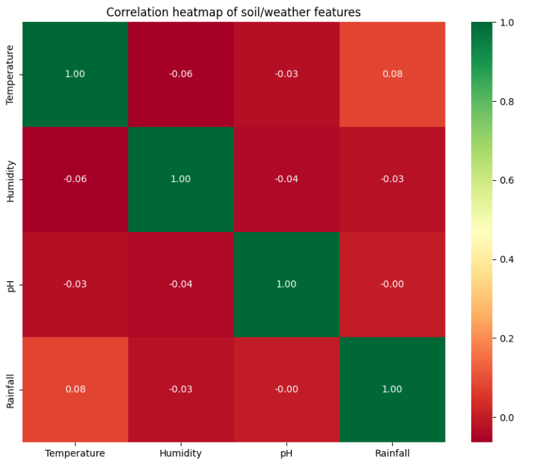
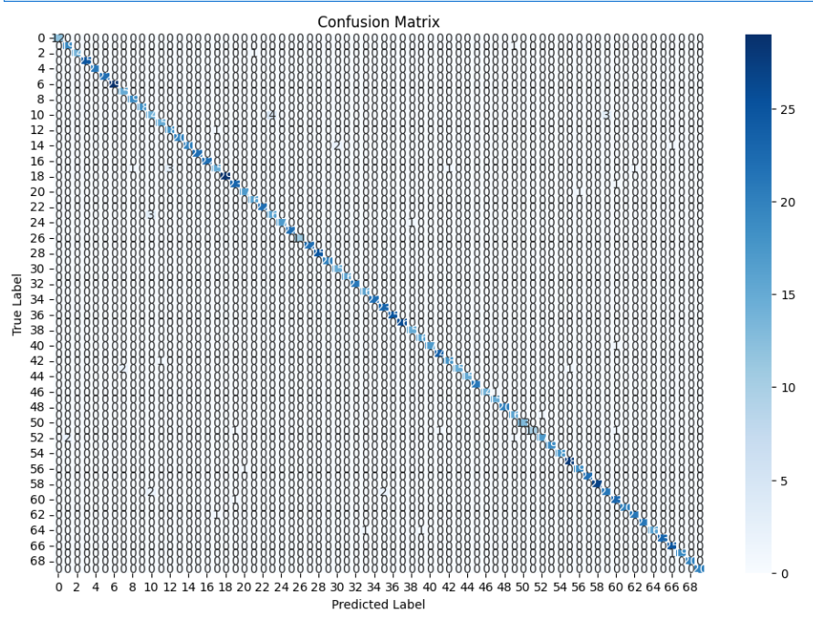

# 🌾 Crop Recommendation System

A machine learning-based recommendation engine that suggests the most suitable crop to grow based on environmental factors like **Temperature**, **Humidity**, **Soil pH**, and **Rainfall**. This project utilizes a **Random Forest Classifier** trained on a diverse dataset of 7,000 entries.

## 🚀 Key Features
* **High Accuracy:** Achieved a prediction accuracy of **96.57%**.
* **Wide Variety:** Supports recommendations for over 70 different crops, including fruits, vegetables, and medicinal plants.
* **Interactive UI:** Includes a Streamlit web application for real-time crop prediction.

## 📊 Dataset Overview
The model is trained on four critical environmental parameters:
* **Temperature** (°C)
* **Humidity** (%)
* **pH Level** of the soil
* **Rainfall** (mm)

### Data Insights
| Metric | Temperature | Humidity | pH | Rainfall |
| :--- | :--- | :--- | :--- | :--- |
| **Mean** | 23.49°C | 71.31% | 6.45 | 751.47mm |
| **Max** | 46.79°C | 99.98% | 9.93 | 5989.99mm |

## 📊 Exploratory Data Analysis
We analyzed the relationship between different features using a correlation heatmap. Rainfall and Humidity showed the most significant impact on specific crop categories.



## 📈 Model Evaluation
The Random Forest model was evaluated using a confusion matrix to identify where the model was misclassifying crops.



## 🛠️ Technical Stack
* **Language:** Python
* **ML Library:** Scikit-learn (Random Forest Classifier)
* **Data Processing:** Pandas, NumPy
* **Normalization:** MinMaxScaler
* **Visualization:** Seaborn, Matplotlib
* **Deployment:** Streamlit

## 📈 Model Performance
The model demonstrates robust performance across all classes. Below is the summary of the classification report:
* **Precision:** 0.97
* **Recall:** 0.96
* **F1-Score:** 0.96

> **Note:** The model shows exceptional performance (1.00 F1-Score) for crops like **Aleovera, Apple, Banana, and Cotton**, while maintaining high reliability for complex categories like **Rice and Coffee**.

## 💻 How to Run
1. **Clone the repository:**
   ```bash
   git clone https://github.com/YOUR_USERNAME/Crop-Recommendation-System.git
   ```
2. **Install dependencies:**
   ```bash
   pip install -r requirements.txt
   ```
3. **Launch the app:**
   ```bash
   streamlit run app.py
   ```


---
